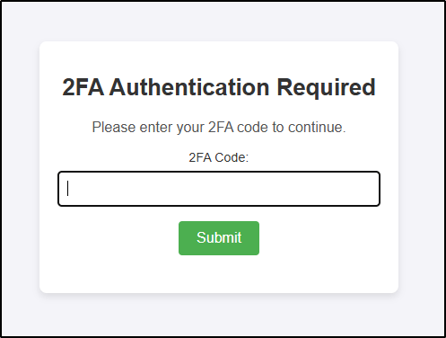

# Caddy Post-Auth 2FA Plugin

> [!NOTE]
> **This plugin is the successor of [caddy-basicauth-totp](https://github.com/steffenbusch/caddy-basicauth-totp).**
> It is not compatible with the old plugin's configuration or secrets file format.
> See below for migration notes and new features.

The **Caddy Post-Auth 2FA** plugin for [Caddy](https://caddyserver.com) adds a second authentication factor (TOTP-based 2FA) after any primary authentication handler (such as `basic_auth` or `jwtauth`).
It is designed to be used after a primary authentication handler and enforces an additional TOTP code check for protected routes.
This plugin supports per-user TOTP secrets (plaintext or AES-GCM-encrypted), JWT-based session management, and optional IP binding for session validation.

> [!TIP]
> For more extensive authentication, authorization, and accounting requirements, consider using [AuthCrunch / caddy-security](https://github.com/greenpau/caddy-security). AuthCrunch provides a comprehensive AAA solution, supporting Form-Based, Basic, Local, LDAP, OpenID Connect, OAuth 2.0 (e.g., GitHub, Google, Facebook), SAML Authentication, and 2FA/MFA (including app-based authenticators and Yubico). It also offers authorization with JWT/PASETO tokens, making it ideal for more complex or larger-scale environments.

**Caddy Post-Auth 2FA** is best suited for smaller, internal user groups who require added security for specific endpoints but do not need a full-featured authentication and authorization solution.
It requires users to authenticate with valid TOTP code.

## Features

- **TOTP 2FA enforcement** after any authentication handler (e.g., `basic_auth`, `jwtauth`)
- **Per-user TOTP secrets** (plaintext or AES-GCM-encrypted), loaded from a JSON file (map of usernames)
- **Configurable inactivity timeout** for 2FA sessions (JWT-based, stateless, cookie storage)
- **Optional IP binding** for session validation (enabled by default, can be disabled)
- **Customizable session cookie** name, path, and domain
- **Customizable HTML form template** for TOTP code entry
- **Per-user or global TOTP code length** (6 or 8 digits)
- **Secure handling of secrets and keys** (Caddy placeholders and file includes supported)
- **No server-side session state:** JWTs are stateless, reloads/restarts do not invalidate sessions
- **AES-GCM encryption** for per-user TOTP secrets (optional, with a base64-encoded key)
- Designed for use cases where an extra authentication layer is needed for admin panels or restricted endpoints

> [!NOTE]
> This module does **not** provide user management, TOTP provisioning, or logout functionality.
> It is intended to be used together with a primary authentication handler.

## Migration from caddy-basicauth-totp

- The secrets file format is now a JSON object mapping usernames to secret objects, not an array.
- Per-user secrets can be stored as plaintext (`totp_secret`) or encrypted (`totp_secret_encrypted`).
- The plugin name and Caddyfile directive have changed (`postauth_2fa`).
- IP binding is now optional and can be disabled.

## Authentication Flow

When accessing a protected route, users must first complete the primary authentication step (such as Basic Authentication, JWT authentication, or another supported handler). After successfully passing this initial authentication, they will be presented with a 2FA prompt from this plugin to enter their TOTP code, as shown below:

<p align="center">
  
</p>

> [!NOTE]
> **Content Security Policy (CSP)**: The 2FA form applies a dedicated CSP header with a unique nonce for inline styles and sets `form-action` to `'self'`, which overwrites any other CSP configuration that might otherwise restrict inline styles or form submissions. This ensures the form functions correctly and securely.

## Disclaimer

**Experimental Module**: This plugin is currently in an experimental phase and is primarily developed to meet specific, personal requirements. While contributions and suggestions are welcome, please be aware that this module may lack certain features or robustness expected in production environments.

> [!Important]
> Due to its experimental nature, this plugin is **not yet intended for use in production or mission-critical systems**. Use it at your own risk. The author assumes no responsibility for potential security risks, stability issues, or data loss that may arise from its use in such environments.

## Building

To build Caddy with this module, use xcaddy:

```bash
$ xcaddy build --with github.com/steffenbusch/caddy-postauth-2fa
```

## Example Caddyfile

```caddyfile
:8080 {
    handle /top-secret/* {
        basic_auth {
            user hashed_password
        }

        postauth_2fa {
            session_inactivity_timeout 2h
            secrets_file_path /path/to/2fa-secrets.json
            cookie_name postauth2fa_sess
            cookie_path /top-secret
            form_template /path/to/custom-2fa-form-template.html
            sign_key {file.jwt-secret.txt}
            encryption_key {file.encryption-key.txt}
            totp_code_length 8
        }

        respond "Welcome, you have passed primary and TOTP authentication!"
    }
}
```

### Configuration Options

- **`session_inactivity_timeout`**: Maximum inactivity before a session expires (default: `60m`).
- **`secrets_file_path`**: Path to a JSON file mapping usernames to TOTP secrets.
- **`cookie_name`**: Name for the session cookie (default: `cpa_sess`).
- **`cookie_path`**: Path scope for the session cookie (default: `/`).
- **`cookie_domain`**: Domain scope for the session cookie (optional).
- **`form_template`**: Path to a custom HTML template for the 2FA form (optional). If not specified, an embedded default template `default-2fa-form.html` will be used.
- **`sign_key`**: Base64-encoded secret key for signing JWTs (required, at least 32 bytes).
- **`encryption_key`**: Base64-encoded key for decrypting encrypted TOTP secrets (required if any `totp_secret_encrypted` entries are present in the secrets JSON file; must be 32 bytes).
- **`totp_code_length`**: (Optional) Specifies the global length of the TOTP code, which can be either 6 (default) or 8 digits. This setting can be overridden for individual users in the secrets file.
- **`username_placeholder`**: Caddy placeholder for extracting the username (default: `{http.auth.user.id}`).
- **`ip_binding`**: Enable/disable IP binding for session validation (`true`/`false`, default: `true`).

#### Placeholder Support

- **`sign_key`** and **`encryption_key`** support Caddy placeholder replacement at **provisioning time** (when the Caddy configuration is loaded).
- **`username_placeholder`** and **`ip_binding`** are evaluated at **runtime** for each relevant request.

### Example JSON structure w/ per-user TOTP Code Length

```json
{
  "alice": {
    "totp_secret": "JBSWY3DPEHPK3PXP"
    // code_length omitted, will use global/default
  },
  "bob": {
    "totp_secret_encrypted": "TmmgOMJTl3um2hAixRJyhbDL9CuUCdUKdaOO78fx+Re7dfsOXwIWtPJe9AM=",
    "totp_code_length": 8
  }
}
```

Use `totp_secret` for plaintext secrets or `totp_secret_encrypted` for AES-GCM-encrypted secrets.

If `totp_code_length` is set for a user, it will override the global `totp_code_length` for that user only.
**Note:** The code length (6 or 8) must match the length that was chosen when the TOTP secret was generated for the user. The plugin does not enforce a specific code length, but validates the code according to the configuration and/or per-user setting.

### Template Context

The available information in the template context includes:

- `Username`: The username of the user (HTML escaped).
- `Errormessage`: Any error message to be displayed.
- `Nonce`: A nonce used for inline styles.
- `TOTPCodeLength`: The required code length for the current user (used for input validation in the form).

### Session (JWT) Management Explanation

After a user successfully enters their TOTP code, a signed JWT is issued and stored in a browser cookie. This JWT acts as a "session token" to avoid prompting for 2FA on every request. The JWT contains the username, expiration timestamp, and the user's IP address (the IP is always included, regardless of the IP binding configuration). This allows the plugin to validate session inactivity and, if enabled, enforce client IP checks on each request.

The session inactivity timeout (`session_inactivity_timeout`) is enforced by checking the timestamp in the JWT. Each valid request within this timeout period can extend the session expiration by issuing a new JWT, but only if less than 50% of the timeout remains. This reduces unnecessary cookie updates and optimizes performance.

Note: Since JWTs are stateless and stored client-side, there is no server-side session storage or locking. The term "session" here refers to the validity window of the JWT used to skip repeated 2FA prompts.

### Security Considerations

- **Protect your secrets file**: Ensure it is not accessible via the web server.
- **Choose an appropriate inactivity timeout**: Shorter timeouts are more secure.
- **IP binding**: Enabled by default for additional session security.
- **Cookie security**: Cookies are set with `HttpOnly`, `Secure`, and `SameSite=Strict`.
- **Brute-force attack prevention and logging**: To help prevent brute-force attempts on TOTP codes, the plugin logs each invalid TOTP attempt with the username and client IP, such as:

    `2024/11/01 08:08:36.099 WARN    http.handlers.postauth2fa      Invalid TOTP attempt    {"username": "user1", "client_ip": "4.8.15.16"}`

    This log entry provides crucial information for security monitoring and can be used with `fail2ban` or similar tools to block repeated failed attempts.
- **TOTP validation settings**: The plugin uses TOTP validation settings compatible with Google Authenticator, including:
  - 6-digit codes by default, or 8-digit codes if configured globally or per user,
  - A 30-second code validity period,
  - A skew allowance of one period (±30 seconds) for clock drift,
  - SHA-1 as the HMAC algorithm.

  These settings are applied by default in the `Validate` function to maintain compatibility with most authenticator apps while ensuring secure TOTP verification.

### Generating a TOTP-compatible Secret

To create a secure, random key in the correct format, you can use the following command:

```bash
openssl rand 30 | base32 | tr --delete '='
```

**Explanation of the command:**

- **`openssl rand 30`**: Generates 30 random bytes.
- **`| base32`**: Converts the random bytes to Base32 format.
- **`| tr --delete '='`**: Removes any `=` padding characters, which are not needed in TOTP format.

This Base32 key can then be used by the TOTP library to generate one-time passwords.

#### Setting Up the Secret in a 2FA App

If you want to set up the secret directly in a 2FA app, you can also generate a QR code that includes the Base32 secret. A useful tool for this is the [2FA QR Code Generator](https://stefansundin.github.io/2fa-qr/), where you can input the Base32 key to create a scannable QR code for the app.

### Encrypting a TOTP Secret

Use the provided CLI tool (`encrypt-totp-secret.go`) to encrypt a TOTP secret, then place the encrypted value in the `totp_secret_encrypted` field of your JSON secrets file.

```bash
go run cmd/encrypt-totp-secret.go [TOTP_SECRET] [BASE64_KEY]
```

If arguments are omitted, the tool will prompt for them interactively.

---

## License

This project is licensed under the Apache License, Version 2.0. See the [LICENSE](LICENSE) file for details.

## Acknowledgements

- [Caddy](https://caddyserver.com) for providing a powerful and extensible web server.
- [pquerna/otp](https://github.com/pquerna/otp) for TOTP functionality, used under the Apache License 2.0.
